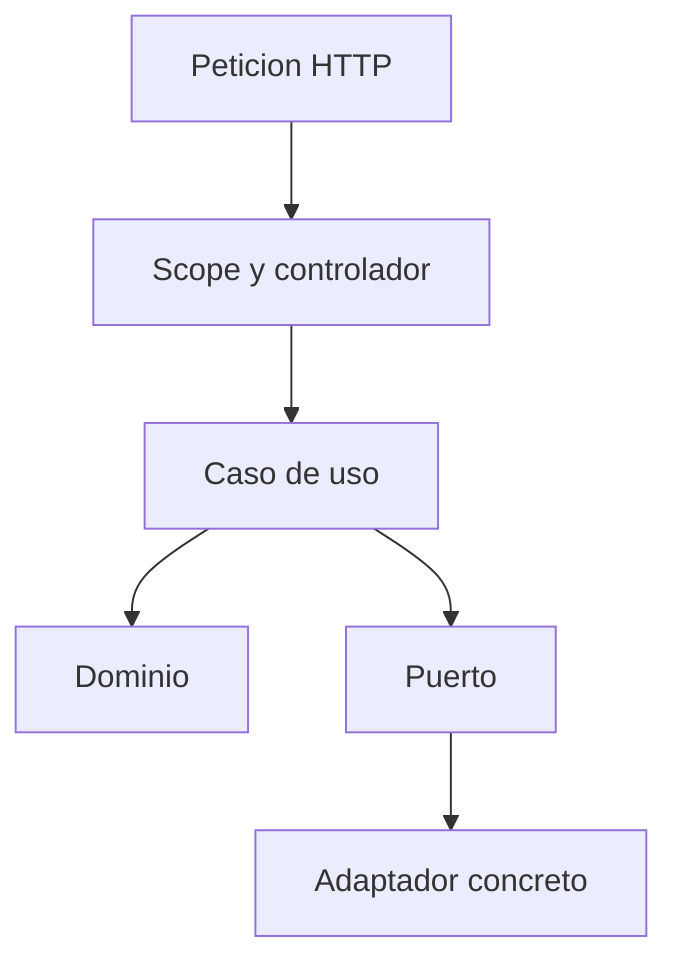

# Clean Architecture TypeScript Practice

Laboratorio demostrativo de una API de pedidos construida con TypeScript. El proyecto muestra, de forma practica, como organizar un dominio, casos de uso, puertos, adaptadores, composicion de dependencias, persistencia PostgreSQL y el patron Outbox.

No es una plataforma de comercio electronico completa ni implementa autenticacion, pagos u otras garantias operativas fuera del alcance de este ejemplo.

## Arquitectura

Las dependencias apuntan hacia dentro: el dominio no conoce la aplicacion ni la infraestructura; la aplicacion depende de puertos; y la composicion conecta esos puertos con adaptadores concretos.

| Capa | Responsabilidad |
| --- | --- |
| `domain` | Entidades, Value Objects, invariantes y eventos de dominio. |
| `application` | Casos de uso, DTO, puertos y coordinacion de la aplicacion. |
| `infrastructure` | Adaptadores HTTP, PostgreSQL, Outbox, logging, reloj y precios en memoria. |
| `composition` | Configuracion y composicion manual de dependencias por entorno. |
| `shared` | Contratos utilitarios compartidos, como `Result`. |



La construccion del proceso sigue `config -> buildAppContext -> createContainer -> buildServer`. En una peticion, el resultado del caso de uso vuelve al controlador, que lo presenta como respuesta HTTP.

En las escrituras con PostgreSQL, `PostgresUnitOfWork` coordina la persistencia del agregado y la insercion de sus eventos en `outbox` cuando esta habilitado `DomainEventOutboxPublisher`. El worker Outbox se ejecuta como proceso separado.

## Casos De Uso

La capa de aplicacion expone casos de uso pequenos y orientados a una intencion concreta:

| Caso de uso | Entrada | Salida | Ruta HTTP |
| --- | --- | --- | --- |
| `CreateOrder` | `orderId`, `customerId` | `orderId` | `POST /orders` |
| `AddItemToOrder` | `orderId`, `sku`, `quantity` | Item anadido con precio unitario, total y fecha | `POST /orders/:orderId/items` |
| `ListOrders` | sin parametros | Listado de ordenes con `orderId`, `customerId` y `totalPrice` | `GET /orders` |
| `FindOrdersByCustomerId` | `customerId` | `customerId` y listado de ordenes con `orderId` y `totalPrice` | `GET /customers/:customerId/orders` |
| `GetOrderItems` | `orderId` | Items de la orden y total de la orden | `GET /orders/:orderId/items` |

## Requisitos Previos

- Node.js 22 o superior.
- npm.
- Docker y Docker Compose, si se quiere ejecutar PostgreSQL local.
- PostgreSQL accesible si se usa `USE_INMEMORY=false` sin Docker.

## Instalacion

Instala las dependencias con `npm ci` para usar el `package-lock.json`, o con `npm install` durante el desarrollo.

La aplicacion puede ejecutarse con persistencia en memoria o PostgreSQL:

- En `development` y `test`, el modo memoria es el predeterminado.
- Con `USE_INMEMORY=false`, se seleccionan los adaptadores PostgreSQL y se requiere `DATABASE_URL`.
- En `production`, PostgreSQL y Outbox son los valores predeterminados, aunque los flags pueden sobrescribirlos.

## Configuracion

La aplicacion carga `.env` y `process.env`; las variables presentes en `process.env` prevalecen. Para PostgreSQL local, Docker Compose y el script de migraciones usan `.env.db`. El script requiere `POSTGRES_USER` y `POSTGRES_DB`; la aplicacion requiere ademas `DATABASE_URL`.

Para preparar el escenario local de PostgreSQL con Outbox, copia los ejemplos:

```bash
cp .env.example .env
cp .env.db.example .env.db
```

`.env` configura la aplicacion; `.env.db` configura PostgreSQL local y el script de migraciones.

Variables principales:

| Variable | Uso |
| --- | --- |
| `NODE_ENV` | Selecciona `development`, `test` o `production`. |
| `USE_INMEMORY` | Selecciona persistencia en memoria o PostgreSQL. |
| `USE_MEMORY` | Alias de compatibilidad de `USE_INMEMORY`. |
| `DATABASE_URL` | Conexion requerida al usar PostgreSQL. |
| `USE_OUTBOX` | Activa el publisher Outbox cuando se usa PostgreSQL. |
| `OUTBOX_WORKER_MODE` | `once` o `loop`. |
| `OUTBOX_BATCH_SIZE` | Tamano maximo de cada lote del dispatcher. |
| `OUTBOX_POLL_INTERVAL_MS` | Espera entre lotes en modo `loop`. |
| `LOG_LEVEL` y `LOG_PRETTY` | Nivel y formato de salida del logger Pino. |
| `PORT` | Puerto HTTP. |

El resto de opciones de base de datos, precios y logging se valida y normaliza en `src/composition/config.ts`.

## Comandos

Desarrollo:

```bash
npm run dev
```

Build y ejecucion del resultado compilado:

```bash
npm run build
npm run start
```

PostgreSQL y migraciones:

```bash
npm run db:up
npm run db:migrate
npm run db:down
```

El modo memoria no necesita PostgreSQL ni migraciones. El script de migraciones usa Docker Compose y aplica los archivos de `db/migrations` en orden.

Worker Outbox:

```bash
npm run worker:outbox
OUTBOX_WORKER_MODE=loop npm run worker:outbox
```

El worker es un proceso separado del servidor HTTP.

Validacion local:

```bash
npm run check
npm run check:tests
npm test
```

`npm run validate` agrupa esos tres comandos.

CI:

El workflow de GitHub Actions instala con `npm ci` y ejecuta exactamente `npm run check` y `npm test`. No ejecuta `build`, `check:tests` ni `npm run validate`.

## Observabilidad

El servidor genera un `requestId` por peticion y lo devuelve en `x-request-id`; su uso es local al proceso y no proporciona trazabilidad distribuida. Se registran metadatos seleccionados de la peticion y se evita registrar el `body` completo.

La implementacion normal usa Pino. `NoopLogger` permite construir componentes sin salida de logs. No existe redaccion automatica general de secretos.

## Persistencia Y Outbox

Con `USE_INMEMORY=true`, la persistencia vive en memoria y los eventos usan un publicador no-op. Con PostgreSQL, `PostgresUnitOfWork` y `DomainEventOutboxPublisher` pueden guardar el agregado y sus eventos en la misma transaccion. El dispatcher procesa despues los registros pendientes.

`once` ejecuta una iteracion y `loop` continua procesando lotes con una espera entre iteraciones. El handler predeterminado solo registra el evento; no hay un consumidor externo implementado.

El sistema no implementa entrega exactamente una vez, idempotencia del consumidor, politica explicita de reintentos, backoff ni dead-letter queue.

El detalle de invariantes, transacciones, rehidratacion y procesamiento Outbox esta documentado junto a sus implementaciones.

## URLs Operativas

### Crear Orden

```http
POST /orders
```

Ejemplo:

```bash
curl -i -X POST http://localhost:3000/orders \
  -H "Content-Type: application/json" \
  -d '{"orderId":"order-1","customerId":"customer-1"}'
```

Respuesta:

```json
{
  "orderId": "order-1"
}
```

### Anadir Item A Una Orden

```http
POST /orders/:orderId/items
```

Ejemplo:

```bash
curl -i -X POST http://localhost:3000/orders/order-1/items \
  -H "Content-Type: application/json" \
  -d '{"sku":"LAPTOP-001","quantity":2}'
```

Respuesta:

```json
{
  "orderId": "order-1",
  "sku": "LAPTOP-001",
  "quantity": 2,
  "unitPrice": {
    "amount": 899.99,
    "currency": "EUR"
  },
  "totalPrice": {
    "amount": 1799.98,
    "currency": "EUR"
  },
  "addedAt": "2026-08-31T18:00:00.000Z"
}
```

El valor de `addedAt` es orientativo; en ejecucion real se genera con la fecha actual.

### Consultar Ordenes

```http
GET /orders
```

Ejemplo:

```bash
curl -i http://localhost:3000/orders
```

Respuesta:

```json
{
  "orders": [
    {
      "orderId": "order-1",
      "customerId": "customer-1",
      "totalPrice": {
        "amount": 1799.98,
        "currency": "EUR"
      }
    }
  ]
}
```

### Consultar Ordenes De Un Cliente

```http
GET /customers/:customerId/orders
```

Ejemplo:

```bash
curl -i http://localhost:3000/customers/customer-1/orders
```

Respuesta:

```json
{
  "customerId": "customer-1",
  "orders": [
    {
      "orderId": "order-1",
      "totalPrice": {
        "amount": 1799.98,
        "currency": "EUR"
      }
    }
  ]
}
```

### Consultar Items De Una Orden

```http
GET /orders/:orderId/items
```

Ejemplo:

```bash
curl -i http://localhost:3000/orders/order-1/items
```

Respuesta:

```json
{
  "orderId": "order-1",
  "items": [
    {
      "sku": "LAPTOP-001",
      "quantity": 2,
      "unitPrice": {
        "amount": 899.99,
        "currency": "EUR"
      },
      "totalPrice": {
        "amount": 1799.98,
        "currency": "EUR"
      }
    }
  ],
  "totalPrice": {
    "amount": 1799.98,
    "currency": "EUR"
  }
}
```

## Estructura

```text
src/
  domain/
  application/
  infrastructure/
  composition/
  shared/
tests/
scripts/
db/migrations/
```

## Validacion

Validacion local completa:

```bash
npm run validate
```

Este comando ejecuta `npm run check`, `npm run check:tests` y `npm test`.
